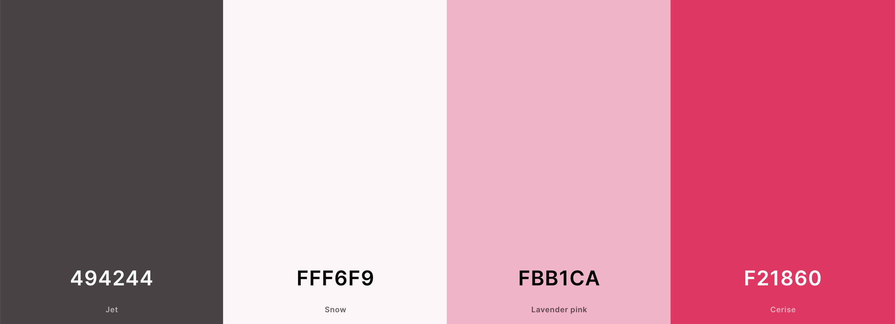
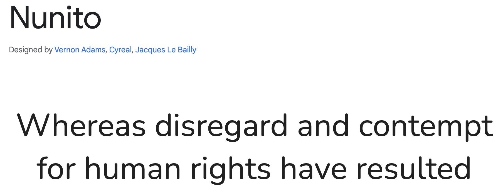
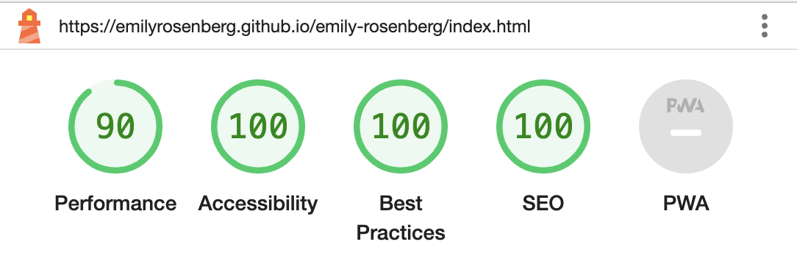
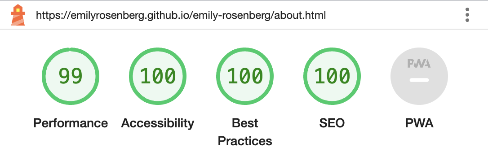
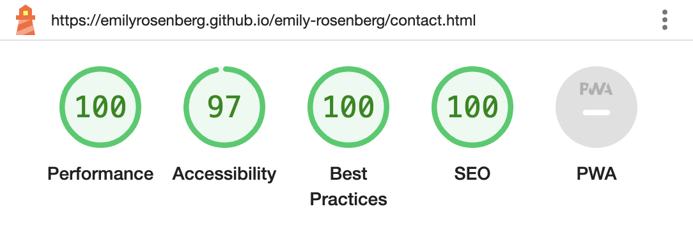
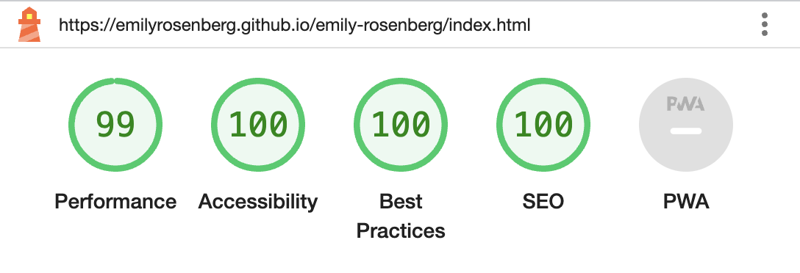
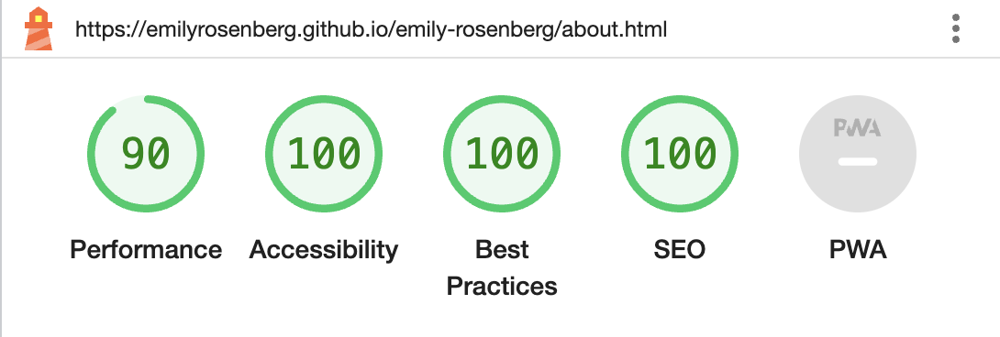
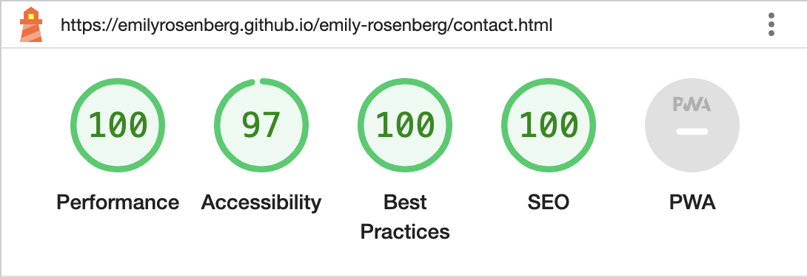

# ✏️ Emily Rosenberg
A career website to share with potential employers

## UX
### Website owner goals
The purpose of this website is to present myself to potential employers as a junior web developer. It will showcase skills, past achievements, and my career path, and provide an easy way to contact me. It can be updated with new information as necessary.

### User goals
New user goals:
- User is able to find information about my past experience and skills.
- User is able to contact me easily using a contact form.

Returning user goals:
- User is able to find out about my recent projects and qualifications.

### User stories
As a job-seeking junior web developer:
- I would like to show potential employers my qualifications.
- I would like to show what’s special about me as a team member.
- I would like to be contacted by potential employers.

As a potential future employer:
- I would like to find out about a potential employee’s qualifications.
- I would like to have a sense of how they would fit into my team.

### Structure of the website
This website is designed to provide necessary information quickly and clearly on all types of devices. The user will be able to accomplish their goals with a satisfying user experience.

### Surface
Colors  
I developed a color palette using Coolors. I started out with a softer palette but then the background image I found inspired the choice of hot pink. The strong, eye-catching color, grounded by soft dark brown, is a good representation of my personal brand.  
  
[Coolors](https://coolors.co/494244-fff6f9-fbb1ca-f21860)

Fonts  
I used Google Fonts and chose a rounded, modern sans serif font that is easy to read.  
 
[Google Fonts](https://fonts.google.com/specimen/Nunito?stroke=Sans+Serif&sort=popularity)

Images  
I used Unsplash to find and download the main background image. The colorful pencils are playful, and represent a toolbox of options and a tactile approach. Credit: Jess Bailey. 
  
Profile image credit: Olivia Woodrow

## Features
The website has 3 pages, all accessible from the navigation bar. Home is an intro page, About has a few facts about me and my experience and a link to my CV, and Contact has a form to send a message.

### Navigation bar
The navigation bar is visible in the header fixed to the top of each page. It is responsive and on mobile it shows as a toggle with a dropdown menu; on desktop the menu items are in the header.
 
Navigation scheme: There are 3 menu items: Home, About, and Contact.

### Home page
The landing page has a colorful image and large text, to invite potential employers to learn more.

### About page
The about page includes professional experience including my future graduation date from Code Institute, a few fun facts, and a profile image. It can be updated with additional qualifications in the future.

### Contact page
The contact page has links to my LinkedIn and Github plus a simple form for entering contact information and sending a message.

### Footer
The footer appears on all pages. It has links to LinkedIn, Github, and the Contact page.

### Favicon
I used a pencil emoji as a favicon, building a connection to my landing page background image.  
[Pencil emoji favicon](https://favicon.io/emoji-favicons/pencil)

### Future implementations
Portfolio gallery  
Project links

### Technologies used:
HTML 5 as a structure language  
CSS as a style language  
Font Awesome  
Google Fonts  
GitHub  
Git  
Gitpod  

## Testing

### Functionality testing

### Compatibility testing
The deployed website was tested throughout the building process with Chrome Devtools, on Chrome and Safari, on the following devices:
 
iPhone 12 Mini  
Macbook Air

### User stories testing
As a job-seeking junior web developer:
- _I would like to show potential employers my qualifications._  
The About page shows my career path.
- _I would like to show what’s special about me as a team member._  
The website's branding is direct and bold yet friendly and approachable.
- _I would like to be contacted by potential employers._  
The Contact page has a simple and easy contact form, reachable from everywhere on the website.

As a potential future employer:
- _I would like to find out about a potential employee’s qualifications._  
The About page shows my career path including the date I will graduate from the Code Institute course.
- _I would like to have a sense of how they would fit into my team._  
The headings and the About page are intentionally informal and friendly, and my interpersonal skills are included.

## Issues found during development

### Performance testing
I used Chrome Developer Tools for troubleshooting functionality and style problems during development. After deploying, some issues were still unresolved. Trial and error, Googling - and patience! - were most helpful. This is how I learned the most.  
I used the Lighthouse tool to test performance in incognito mode, as suggested by my mentor. After making corrections to the meta description and the profile image size, these were the results on mobile:     
And on desktop:  

### Code validation
- HTML   I validated the HTML code with W3C and found 2 errors in the meta description. The typos were easily corrected.

- CSS   I validated the CSS code with (Jigsaw) validator and found 1 error in the margin of the name styles in the header. I decided that this style wasn't working anyway, and deleted the line.

## Deployment
This website was deployed on GitHub pages.  
The live link can be found [here](https://emilyrosenberg.github.io/emily-rosenberg/index.html).

## Credits
- I used code from the Love Running Walkthrough Project extensively to outline this project. As the project progressed, I was able to replace much of the original code with my own code. The structure and styling of several areas, including the navigation bar and the contact form, remain very close or identical to code from the walkthrough project.  
- I was able to solve problems with help from Stack Overflow, FreeCodeCamp, and MakeUseOf.  
- I used [this readme](https://github.com/marcin-kli/MP1/blob/Milestone-Projects/README.md#annies-portfolio-website) as a framework for writing my readme.
- I would like to thank my Code Institute mentor, Adegbenga Adeye, for reassurance, support, and extra resources.  
- Thanks to my Cohort Facilitator, David Calikes, for advice about how to create an MVP on the "fast track."  
- And I'm also thankful to my teachers at the Digital Career Institute who patiently guided me through the basics for the first time, earlier this year.